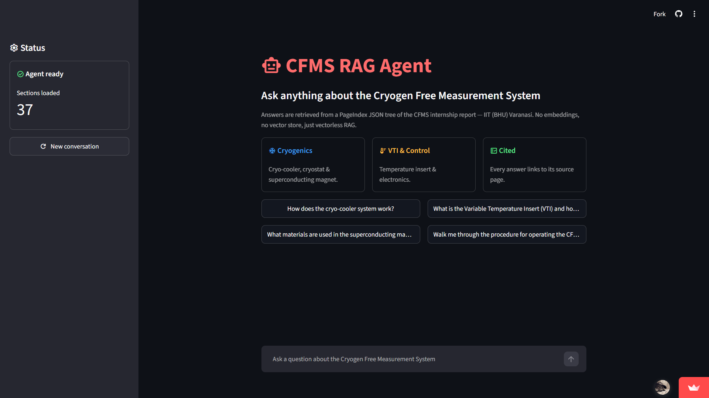
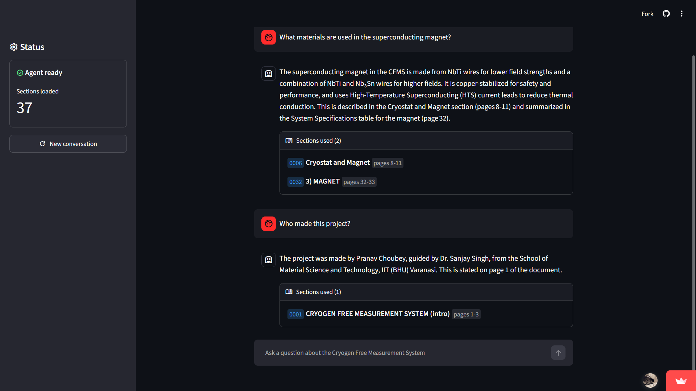

# CFMS RAG Agent

A **vectorless, tree-based Retrieval-Augmented Generation (RAG) assistant** for answering questions about the **Cryogen Free Measurement System (CFMS)** project report made by **Pranav Choubey** during his internship at **IIT (BHU), Varanasi**.

The application combines **PageIndex**, **LangChain/LangGraph**, and an **NVIDIA-hosted LLM** to retrieve relevant sections from a structured document tree and generate answers with **section and page-level citations**.

Unlike conventional RAG systems, this project does **not** use chunkings, embeddings or a vector database. Instead, the document is represented as a JSON based hierarchical/tree index, and the agent uses that structure to decide which sections and pages it needs to read.

---

## 🚀 Live Website

- Try the agent now - [CFMS RAG Agent Website](https://cfms-rag-agent.streamlit.app/)

---

## 👨‍💻 Author - Pranav Choubey

**AI/ML Engineer** building end-to-end AI, data science, and intelligent applications.

**LinkedIn profile:** [pranavchoubey89](https://www.linkedin.com/in/pranavchoubey89/)
**GitHub profile:** [PRANAV424](https://github.com/PRANAV4248)

---

## 🏠 Home Page



## 💬 Chat Interface



---

## ✨ Highlights

- 🌳 **Vectorless RAG** using a PageIndex document tree
- 🔎 Retrieves relevant document sections instead of performing vector similarity search
- 🤖 Agentic question answering powered by LangChain/LangGraph
- 🧠 NVIDIA-hosted LLM with deterministic generation (`temperature=0`)
- 📚 Answers include the **section names and page numbers** used
- 💬 Conversational memory for follow-up questions within a session
- 🖥️ Interactive Streamlit chat interface
- 🚦 Built-in request rate limiting
- 💾 Local caching of the PageIndex document ID and generated document tree
- 🧪 Separate lightweight script for testing the NVIDIA LLM API
- 🧰 CLI available through `main.py`

---

## 🧠 What is Vectorless RAG?

Traditional RAG systems commonly follow this pipeline:

```text
Document
   ↓
Chunking
   ↓
Embeddings
   ↓
Vector Database
   ↓
Similarity Search
   ↓
LLM
   ↓
Answer
```

This project takes a different approach:

```text
CFMS PDF
   ↓
PageIndex
   ↓
Hierarchical Document Tree
   ↓
Agent selects relevant sections
   ↓
Page-level content retrieval
   ↓
LLM
   ↓
Answer + cited sections/pages
```

There are **no embeddings and no vector store** in the retrieval pipeline.

The core implementation explicitly describes the application as a PageIndex-backed, tree-structured RAG system without embeddings or a vector store.

---

## 📖 Knowledge Base

The assistant is designed around a **34-page CFMS internship report from IIT (BHU), Varanasi**.

The document covers topics including:

- Cryogen-free measurement systems
- Cryo-cooler system
- Cryostat
- Superconducting magnet
- Variable Temperature Insert (VTI)
- Electronics rack
- LabVIEW measurement software
- Operating procedures
- Safety and warm-up guidelines
- Maintenance
- Troubleshooting
- Applications
- System specifications

The agent is instructed to use the document’s table of contents to locate relevant sections and to cite the specific section and page numbers used to produce an answer.

---

## 🏗️ Architecture

```text
                         ┌──────────────────────┐
                         │    Streamlit UI      │
                         │      app.py          │
                         └──────────┬───────────┘
                                    │
                                    ▼
                         ┌──────────────────────┐
                         │       RagApp         │
                         │     rag_core.py      │
                         └──────────┬───────────┘
                                    │
                 ┌──────────────────┼──────────────────┐
                 │                  │                  │
                 ▼                  ▼                  ▼
        ┌────────────────┐ ┌────────────────┐ ┌─────────────────┐
        │    PageIndex   │ │ LangChain /    │ │ LangGraph       │
        │ Document Tree  │ │ Chat Model     │ │ Agent + Memory  │
        └────────────────┘ └────────┬───────┘ └─────────────────┘
                                    │
                                    ▼
                         ┌──────────────────────┐
                         │ NVIDIA API           │
                         │ Nemotron model       │
                         └──────────────────────┘
                                    │
                                    ▼
                         ┌──────────────────────┐
                         │ Structured Answer    │
                         │ + Section IDs        │
                         │ + Page References    │
                         └──────────────────────┘
```

---

## 🔄 End-to-End Query Flow

When a user asks a question through the Streamlit interface:

### 1. Streamlit receives the question

The question enters through `st.chat_input()`.

The application maintains the conversation in `st.session_state`.

### 2. `RagApp` processes the query

The Streamlit application creates the core `RagApp` instance from `rag_core.py`.

### 3. PageIndex identifies relevant document content

The PDF is submitted to PageIndex when required.

The project caches the returned document ID in:

```text
src/documents/pageindex_docs.json
```

The generated PageIndex tree is cached under:

```text
src/documents/trees/
```

This avoids repeatedly creating the same document index.

### 4. The agent uses the document tree

The agent receives the document context and a table of contents containing:

```text
node_id
section title
start page
end page
```

The model is instructed to select relevant nodes and retrieve the corresponding page content.

### 5. The LLM generates a structured answer

The response follows a Pydantic schema containing:

```text
is_doc_query
answer
node_ids
```

This lets the UI distinguish between:

- document-related questions
- greetings/off-topic questions

and identify which document sections were actually used.

### 6. Streamlit displays the result

For document questions, the UI displays:

```text
Answer

Sections used
├── Section ID
├── Section title
└── Page range
```

This makes the answer traceable back to the source document.

---

# 🗂️ Project Structure

```text
Vectorless_RAG/
│
├── .venv/
│
├── src/
│   ├── documents/
│   │   ├── CFMS_guide.pdf
│   │   ├── pageindex_docs.json
│   │   └── trees/
│   │       └── tree_<document_id>.json
│   │
│   ├── app.py
│   ├── main.py
│   ├── rag_core.py
│   └── test.py
│
├── .env
├── .gitignore
├── .python-version
├── pyproject.toml
├── README.md
└── uv.lock
```

### File responsibilities

| File                                  | Purpose                                                              |
| ------------------------------------- | -------------------------------------------------------------------- |
| `src/app.py`                        | Streamlit web interface                                              |
| `src/rag_core.py`                   | Core RAG agent, PageIndex integration, LLM setup and retrieval logic |
| `src/main.py`                       | Command-line interface for asking questions                          |
| `src/test.py`                       | Simple NVIDIA LLM API connectivity test                              |
| `src/documents/CFMS_guide.pdf`      | CFMS knowledge-base document                                         |
| `src/documents/pageindex_docs.json` | Cached PageIndex document ID                                         |
| `src/documents/trees/`              | Cached PageIndex document trees                                      |
| `.env`                              | Local API credentials and optional tracing configuration             |
| `pyproject.toml`                    | Python project/dependency configuration                              |
| `uv.lock`                           | Locked dependency versions                                           |

---

# 🛠️ Tech Stack

## Frontend

- **Streamlit**
- Streamlit Material Icons
- Streamlit chat components
- Streamlit containers, cards and expanders

## AI / Agent Layer

- **LangChain**
- **LangGraph**
- NVIDIA-hosted LLM
- Pydantic structured output
- In-memory conversation checkpointing

## Retrieval

- **PageIndex**
- Hierarchical document tree
- Page-level document retrieval

## Model

The main application currently uses:

```text
nvidia/nemotron-3-super-120b-a12b
```

through NVIDIA’s OpenAI-compatible endpoint:

```text
https://integrate.api.nvidia.com/v1
```

## Development

- Python
- `uv`
- `python-dotenv`

---

# ⚙️ How the Core Agent Works

The main implementation is contained in:

```text
src/rag_core.py
```

The `RagApp` class is responsible for the complete RAG pipeline.

It:

1. Loads environment variables.
2. Validates required API keys.
3. Initializes the PageIndex client.
4. Creates or retrieves the PageIndex document ID.
5. Creates or loads the document tree.
6. Converts the tree into a searchable node mapping.
7. Configures an in-memory rate limiter.
8. Initializes the NVIDIA-hosted chat model.
9. Builds the LangChain agent.
10. Maintains conversation state.
11. Returns structured answers containing referenced section IDs.

The application also uses middleware for model retries and context management.

---

# 🔑 Environment Variables

Create a `.env` file in the project root:

```env
PAGEINDEX_API_KEY=your_pageindex_api_key
NVIDIA_API_KEY=your_nvidia_api_key
```

Optional LangSmith tracing variables are also supported:

```env
LANGSMITH_TRACING=true
LANGSMITH_API_KEY=your_langsmith_api_key
LANGSMITH_PROJECT=pageindex-rag
```

### Important

Never commit `.env` to Git.

Your `.gitignore` should exclude secrets such as:

```text
.env
```

---

# 🚀 Installation

## Prerequisites

Make sure you have:

- Python installed
- `uv` installed
- A PageIndex API key
- An NVIDIA API key

---

## 1. Clone the repository

```bash
git clone <YOUR_REPOSITORY_URL>
cd Vectorless_RAG
```

Replace `<YOUR_REPOSITORY_URL>` with the repository URL.

---

## 2. Create/sync the environment

Because the project contains both `pyproject.toml` and `uv.lock`, `uv` can be used to reproduce the project environment.

```bash
uv sync
```

Activate the virtual environment if needed.

### Windows PowerShell

```powershell
.venv\Scripts\Activate.ps1
```

---

## 3. Configure environment variables

Create:

```text
.env
```

and add:

```env
PAGEINDEX_API_KEY=your_pageindex_api_key
NVIDIA_API_KEY=your_nvidia_api_key
```

---

## 4. Add the knowledge-base document

Place the CFMS report at:

```text
src/documents/CFMS_guide.pdf
```

The core application expects this exact path by default.

---

# ▶️ Running the Streamlit Application

From the project root:

```bash
streamlit run src/app.py
```

The browser interface provides:

- Agent status
- Section count
- New conversation control
- Starter questions
- Conversational Q&A
- Source section information
- Page references

---

# 💻 Running the CLI

The project also provides a command-line interface.

Run:

```bash
python src/main.py
```

or, when using `uv`:

```bash
uv run python src/main.py
```

You can then enter questions interactively:

```text
Ask your question about the document:
```

Enter:

```text
q
```

to exit.

---

# 🧪 Testing the NVIDIA API

A lightweight API test is provided in:

```text
src/test.py
```

It initializes an OpenAI-compatible LangChain chat model using the NVIDIA endpoint and sends interactive questions.

Run:

```bash
python src/test.py
```

This is useful for checking whether the NVIDIA API credentials and model endpoint are working independently of the full RAG pipeline.

The test script currently uses:

```text
openai/gpt-oss-20b
```

while the main RAG application uses:

```text
nvidia/nemotron-3-super-120b-a12b
```

---

# 🧩 Structured Output

The RAG agent returns a structured response rather than relying on unstructured text parsing.

Conceptually:

```python
class Answer(BaseModel):
    is_doc_query: bool
    answer: str
    node_ids: list[str]
```

### `is_doc_query`

Indicates whether the question is related to the CFMS document.

### `answer`

Contains the generated response.

### `node_ids`

Contains the document sections referenced or read by the agent.

This structure allows the frontend to display the source sections used for an answer.

---

# 📚 Citation / Traceability

One of the main goals of the project is to make generated answers traceable.

The agent is instructed to cite:

- Section name
- Page numbers

The Streamlit interface exposes the retrieved sections inside a **“Sections used”** expandable component.

For example:

```text
Sections used (2)

[0023] Cryogenic System      pages 18-20
[0024] Cryo-cooler Operation pages 21-22
```

This gives the user a way to understand where the answer came from instead of treating the LLM response as an unexplained black box.

---

# 🧠 Conversation Memory

The agent uses an in-memory LangGraph checkpointer.

Each `RagApp` conversation receives a unique thread ID:

```text
thread_id = UUID
```

Starting a new conversation generates a fresh thread.

The Streamlit interface also provides a **New conversation** button that resets the application conversation state.

---

# 🚦 Rate Limiting

The application uses LangChain’s `InMemoryRateLimiter`.

The current configuration is:

```text
requests_per_second = 0.5
check_every_n_seconds = 0.1
max_bucket_size = 5
```

This helps prevent excessive concurrent model/API requests.

The Streamlit application also checks the limiter before processing a user query.

---

# 💾 Caching Strategy

The application avoids repeatedly uploading and indexing the same document.

It maintains:

```text
src/documents/pageindex_docs.json
```

to cache the PageIndex document ID.

The generated document tree is stored under:

```text
src/documents/trees/
```

The workflow is therefore approximately:

```text
First run
   ↓
Upload PDF to PageIndex
   ↓
Receive document ID
   ↓
Generate tree
   ↓
Save document ID + tree locally

Future runs
   ↓
Read cached document ID
   ↓
Read cached tree
   ↓
Initialize agent
```

---

# 🖥️ Streamlit UI

The current interface includes:

### Agent status

Shows whether the RAG agent is ready and how many sections are loaded.

### Starter questions

Provides example questions such as:

```text
How does the cryo-cooler system work?

What is the Variable Temperature Insert (VTI)and how is it controlled?

What materials are used in the superconducting magnet?

Walk me through the procedure for operating the CFMS.
```

### Chat interface

Users can ask questions naturally without needing to know the report’s
section structure.

### Source sections

Document-related responses expose the sections used by the agent.

---

# 🔐 Security Considerations

## API keys

Never hard-code:

```text
PAGEINDEX_API_KEY
NVIDIA_API_KEY
LANGSMITH_API_KEY
```

Use environment variables.

## `.env`

Keep `.env` outside version control.

---

# 📊 Vector RAG vs. This Approach

| Feature             | Conventional Vector RAG    | This Project                         |
| ------------------- | -------------------------- | ------------------------------------ |
| Document chunking   | Usually required           | PageIndex handles document structure |
| Embeddings          | Required                   | ❌ No                                |
| Vector database     | Usually required           | ❌ No                                |
| Retrieval           | Similarity search          | Tree/section-based retrieval         |
| Document Context    | Often lost during chunking | ✅ Preserved                         |
| Source traceability | Depends on implementation  | ✅ Section + page IDs                |
| Agentic reasoning   | Optional                   | ✅                                   |
| Structured output   | Optional                   | ✅                                   |
| Conversation memory | Optional                   | ✅                                   |
| PageIndex           | ❌                         | ✅                                   |

---

# 🎯 Project Goal

The goal of this project is to demonstrate that useful technical-document question answering does not necessarily require the conventional:

```text
Embeddings → Vector DB → Similarity Search
```

architecture.

Instead, the project explores a **structured, agent-driven retrieval approach** where the document hierarchy itself becomes an important part of retrieval.

For technical documents such as engineering reports, manuals, and research documentation, preserving section relationships and page-level provenance can make the retrieval process easier to inspect and explain.

---

# 📄 Project Summary

**CFMS RAG Agent** is a vectorless RAG application that enables natural-language question answering over a Cryogen Free Measurement System report. It uses PageIndex to create a hierarchical document representation and a LangChain/LangGraph agent to identify and retrieve relevant document sections. An NVIDIA-hosted LLM generates structured answers with section and page references, while Streamlit provides the interactive chat interface.

---
